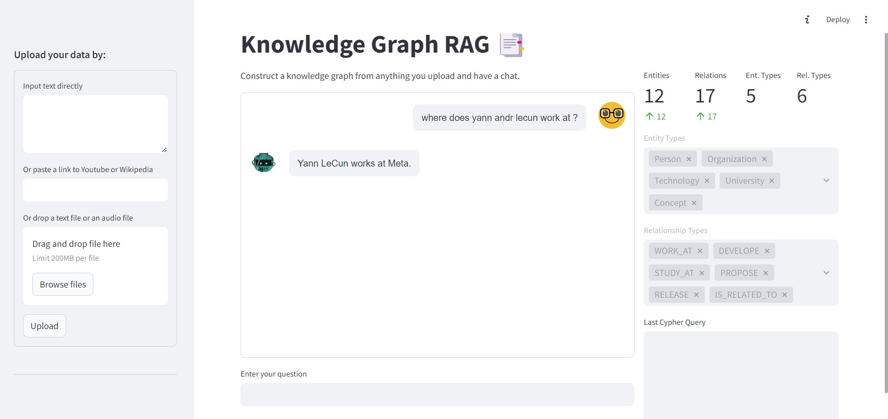
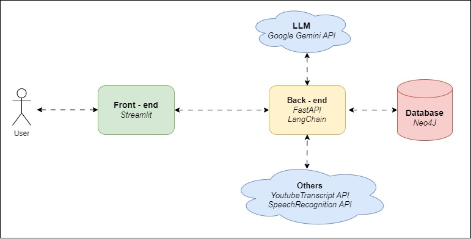

# Knowledge Graph-powered Chatbot



## Project Overview
This project aims to build a knowledge graph-powered chatbot that can extract and leverage knowledge from various data sources, including text, audio files, and URLs. The chatbot is designed to provide users with informative and engaging responses by utilizing the power of a knowledge graph stored in a Neo4J database.

## System Diagram


## Key Features
1. **Data Ingestion and Knowledge Extraction**: The system can ingest data from different sources, including text, audio files, and URLs (Youtube or Wikipedia). It then uses a combination of FastAPI, LangChain, and Gemini API to extract relevant knowledge and build a comprehensive knowledge graph stored in a Neo4J database.

2. **Knowledge Graph Management**: The knowledge graph is managed and stored using Neo4J, a powerful graph database. This allows for efficient storage, querying, and traversal of the extracted knowledge.

3. **Chatbot Interface**: The chatbot is built using Python Streamlit, providing users with an intuitive and user-friendly interface to interact with the system. The chatbot leverages the knowledge graph through a Retrieval-Augmented Generation (RAG) pipeline to generate informative and relevant responses.

## Technologies Used
- **Front-end**: Streamlit
- **Back-end**: FastAPI, LangChain, Neo4J, Google Gemini API

## Run on Docker
To run the example in a machine running Docker and docker compose, run:
```
docker compose build
docker compose up
```
To visit the FastAPI documentation of the resulting service, visit http://localhost:8000/docs with a web browser.

To visit the streamlit UI, visit http://localhost:8501.

Logs can be inspected via:
```
docker compose logs
```
## Future Enhancements
- Refine the current label set. There is also a need for multiple set of labels to suit the different context of use.
- Develope better quality prompts to enhance the chat experience, reduce errors and improve the knowledge extraction process.
- Reduce latency by using a local LLM or moving to specialized small language models (SLMs).
- Support additional data types.

## License
This project is licensed under the [MIT License](LICENSE).